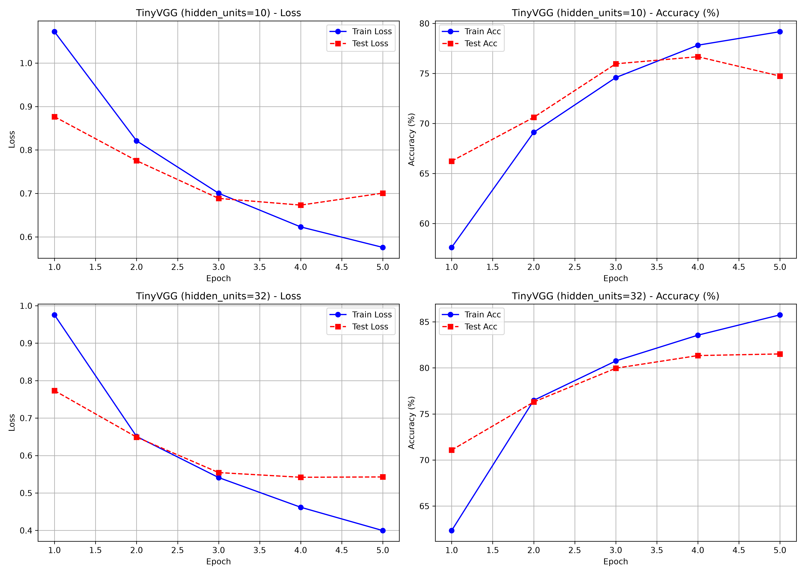
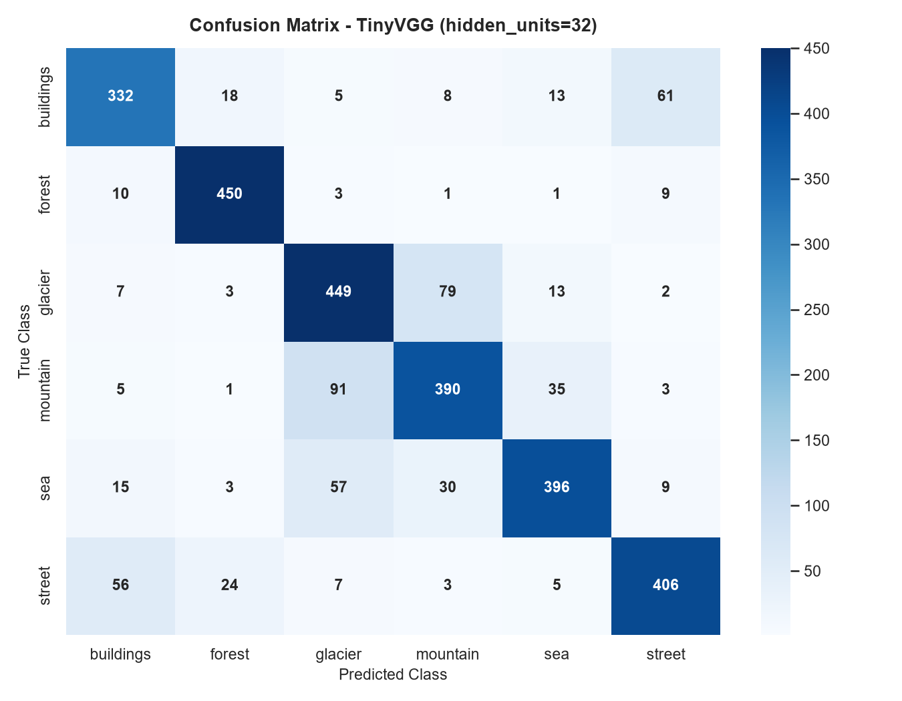
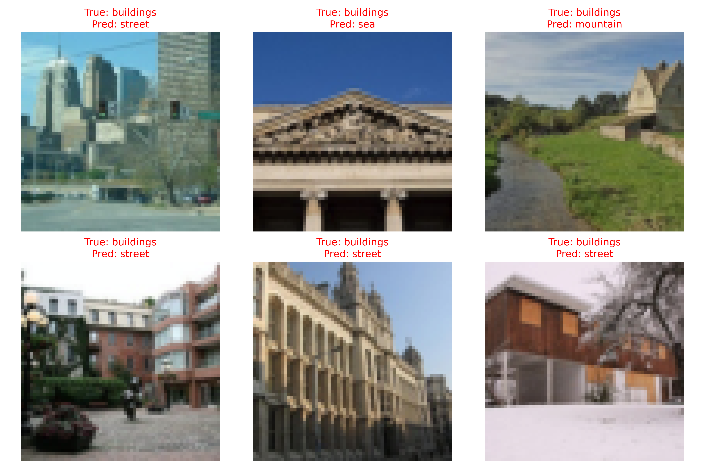

# Intel Image Classification - TinyVGG CNN from Scratch

A PyTorch implementation of a **TinyVGG** convolutional neural network trained from
scratch to classify natural scene images into 6 categories:
uildings, orest, glacier, mountain, sea, street.

The model is deliberately built from scratch (using 
n.Conv2d, 
n.ReLU,

n.MaxPool2d, and 
n.Linear layers) to demonstrate the full
end-to-end deep learning workflow - from data loading and custom training loops
to evaluation, visualization, and model export.

---

## 📊 Dataset

- **Source:** [Intel Image Classification on Kaggle](https://www.kaggle.com/datasets/puneet6060/intel-image-classification)
- **Structure:** data/seg_train/seg_train/ (14,034 images) and data/seg_test/seg_test/ (3,000 images)
- **Classes (6):** uildings, orest, glacier, mountain, sea, street
- **License:** Open dataset released under MIT / CC0 license.

Download via the Kaggle CLI:

`ash
kaggle datasets download -d puneet6060/intel-image-classification -p data --unzip
`

---

## 🏗️ Model Architecture - TinyVGG

The network follows the classic TinyVGG architecture: two convolutional blocks, each
composed of **Conv -> ReLU -> Conv -> ReLU -> MaxPool**, followed by a flatten layer +
linear classifier.

`	ext
Input: (batch, 3, 64, 64) - RGB image resized to 64x64

Block 1: Conv2d(3 -> hidden) -> ReLU -> Conv2d(hidden -> hidden) -> ReLU -> MaxPool2d(2)
Block 2: Conv2d(hidden -> hidden) -> ReLU -> Conv2d(hidden -> hidden) -> ReLU -> MaxPool2d(2)

Classifier: Flatten -> Linear(hidden * 16 * 16 -> 6)
`

- **Activation:** ReLU
- **Pooling:** 2x2 MaxPool with stride 2 (64x64 -> 32x32 -> 16x16)
- **Loss Function:** 
n.CrossEntropyLoss
- **Optimizer:** Adam (lr=0.001)

---

## 📈 Results

Two hyperparameter configurations were compared (5 epochs each, batch size 32, image size 64x64). Test accuracy is on the 3,000-image test split.

| Model | Hidden Units | Epochs | Batch Size | LR | Best Test Accuracy |
|---|---|---|---|---|---|
| **TinyVGG-10** | 10 | 5 | 32 | 0.001 | **76.67%** |
| **TinyVGG-32** | 32 | 5 | 32 | 0.001 | **81.52%** |

TinyVGG-32 (hidden_units=32) achieved the best test accuracy of **81.52%** at epoch 5 and its weights are saved to 
esults/model.pth.

### Loss & Accuracy Curves

### Confusion Matrix (Best Model)

### Misclassified Samples

---

## 📁 Project Structure

`	ext
intel-image-classification/
├── notebooks/
│   ├── training.ipynb        # Full executed walkthrough (models, training, plots)
│   └── kernel-metadata.json  # Kaggle metadata configuration
├── src/
│   ├── data_setup.py         # ImageFolder -> DataLoader creation + transforms
│   ├── model_builder.py      # TinyVGG architecture definition
│   ├── engine.py             # train_step / test_step / train loops
│   ├── utils.py              # Model saving + plotting helpers
│   └── train.py              # CLI entry point
├── results/                  # Plots + best model weights (model.pth)
├── data/                     # Dataset (ignored by git)
├── requirements.txt
└── README.md
`

---

## 🚀 Installation & Usage

### Prerequisites

Requires Python 3.10+ and a CUDA-compatible GPU.

`ash
# 1. Clone repository
git clone https://github.com/emrezorlu1239/intel-image-scene-classification.git
cd intel-image-scene-classification

# 2. Create virtual environment
python -m venv .venv
.\.venv\Scripts\activate

# 3. Install PyTorch with CUDA 12.8 support (Recommended for modern RTX GPUs)
pip install torch torchvision --index-url https://download.pytorch.org/whl/cu128

# 4. Install project dependencies
pip install -r requirements.txt
`

### CLI Training

`ash
# Default training (hidden_units=32, 5 epochs)
python src/train.py

# Custom hyperparameters
python src/train.py --hidden_units 32 --epochs 10 --batch_size 64 --lr 0.0005

# Headless mode (no plots)
python src/train.py --no_plots
`

### Jupyter Notebook

Open and run:

`ash
jupyter notebook notebooks/training.ipynb
`

---

## 📜 Acknowledgments & Kaggle Notebook

This project was developed and benchmarked on Kaggle:
[Intel Image Classification - TinyVGG CNN on Kaggle](https://www.kaggle.com/code/emrezorlu1239/intel-image-classification-tinyvgg-cnn)